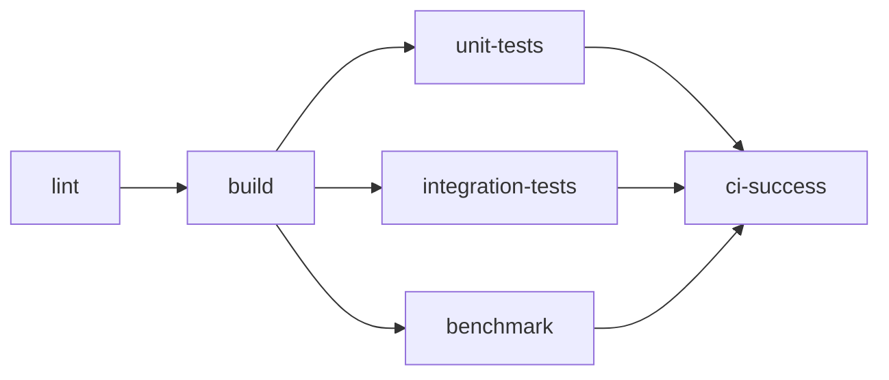

# CI ベンチマーク統合ドキュメント

## 概要
v0.11.0でCIパイプラインにパフォーマンスベンチマークを統合しました。
これにより、Cm言語の性能がC++/Rustと競合できることを自動的に検証します。

## 実装内容

### 1. CIワークフローへの統合 (`.github/workflows/ci.yml`)

#### ベンチマークジョブの追加
- **並列実行**: テストと並行して実行（`needs: build`のみに依存）
- **実行環境**: Ubuntu最新版で実行
- **依存関係**: ビルドジョブ完了後に開始

#### 実行フロー


### 2. ベンチマーク実行手順

#### セットアップ
1. Cmコンパイラのビルド成果物をダウンロード
2. LLVM 18のインストール（JIT実行に必要）
3. g++（C++コンパイラ）のインストール
4. Rustツールチェーンのインストール
5. bc（計算ツール）のインストール

#### ビルドフェーズ
各言語のベンチマークプログラムをコンパイル：
- **Cm**: `-O3`オプションでJITコンパイル
- **C++**: `-O3 -std=c++20`で最適化コンパイル
- **Rust**: `--release`モードでビルド

#### 実行・測定フェーズ
各ベンチマークを実行して時間を測定：
1. 素数判定（エラトステネスの篩、10000まで）
2. フィボナッチ数列（メモ化、40項）
3. 配列ソート（バブルソート、1000要素）
4. 行列乗算（500×500行列）

### 3. パフォーマンス検証

#### 2倍ルール
Cmの実行時間がC++またはRustの2倍を超える場合：
- 警告メッセージを出力
- デフォルトでCIを失敗させる（厳格モード）

#### 制御方法
環境変数`BENCHMARK_STRICT`で動作を制御：
- `true`（デフォルト）: 2倍超過でCI失敗
- `false`: 警告のみ（CIは継続）

### 4. 実装コード例

```bash
# 時間測定
CPP_START=$(date +%s.%N)
timeout 30 cpp/$bench > /dev/null 2>&1
CPP_END=$(date +%s.%N)
CPP_TIME=$(echo "$CPP_END - $CPP_START" | bc)

# 性能比較（2倍チェック）
if (( $(echo "$CM_TIME > $CPP_TIME * 2" | bc -l) )); then
  echo "⚠️ WARNING: Cm is more than 2x slower than C++"
  FAILED=1
fi
```

### 5. 詳細検証スクリプト

`verify_performance.py`が存在する場合、より詳細な検証を実行：
- 各ベンチマークの詳細な時間測定
- JSONレポートの生成
- Markdownレポートの作成

## 利点

### 自動化されたパフォーマンス保証
- PRごとに性能を自動チェック
- パフォーマンスのリグレッションを即座に検出

### 透明性のある性能指標
- ベンチマーク結果をアーティファクトとして保存
- 7日間の保持期間で履歴追跡可能

### 柔軟な制御
- 厳格モードと警告モードの切り替え可能
- 必要に応じて個別のベンチマークをスキップ可能

## トラブルシューティング

### ベンチマークが失敗する場合
1. タイムアウト（30秒）を超えていないか確認
2. ビルド成果物が正しくダウンロードされているか確認
3. LLVMランタイムが正しくインストールされているか確認

### 性能が2倍を超える場合
1. 最適化フラグ（-O3）が適用されているか確認
2. JITコンパイラが正しく動作しているか確認
3. 特定のベンチマークの実装を見直す

## 今後の改善案

1. **より多くのベンチマーク追加**
   - 文字列処理
   - ハッシュテーブル操作
   - 並行処理

2. **プラットフォーム拡張**
   - macOSでのベンチマーク実行
   - ARM64アーキテクチャのサポート

3. **レポート機能強化**
   - グラフによる可視化
   - 過去の結果との比較
   - PRコメントへの自動投稿

## まとめ

CIベンチマーク統合により、Cm言語の性能が継続的に監視され、
C++/Rustと競合可能なパフォーマンスレベルを維持することが保証されます。

これは、v0.11.0でのJITコンパイラ導入の成果を実証し、
今後の最適化作業の基準となる重要な仕組みです。