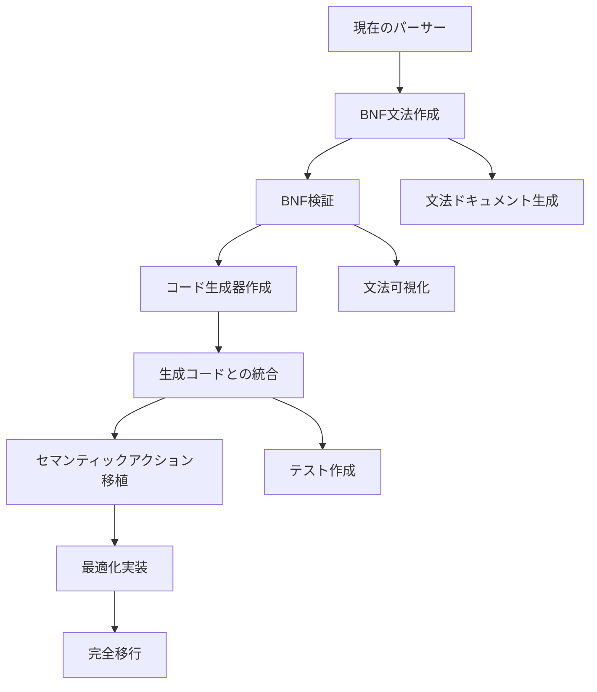

# BNF定義とパーサー統合設計書

作成日: 2026-01-11
対象バージョン: v0.11.0
ステータス: 実装設計

## エグゼクティブサマリー

BNF文法定義を既存のCmパーサーと統合し、文法駆動型のパーサーアーキテクチャを実現します。段階的な移行により、既存機能を維持しながら保守性と拡張性を向上させます。

## 1. 統合アーキテクチャ

### 1.1 全体構成

```
┌─────────────────────────────────────┐
│         BNF Grammar File            │
│      (cm_grammar.bnf)              │
└────────────┬────────────────────────┘
             │
             ▼
┌─────────────────────────────────────┐
│      BNF Parser Generator           │
│   (generates C++ code)             │
└────────────┬────────────────────────┘
             │
             ▼
┌─────────────────────────────────────┐
│     Generated Parser Base           │
│   (bnf_parser_base.generated.hpp)  │
└────────────┬────────────────────────┘
             │ inherits
             ▼
┌─────────────────────────────────────┐
│      Cm Parser Implementation       │
│        (cm_parser.cpp)             │
└─────────────────────────────────────┘
```

### 1.2 レイヤー構造

```cpp
// Layer 1: BNF定義層
// docs/design/cm_grammar.bnf

// Layer 2: 生成コード層
// src/frontend/parser/generated/
class BNFParserBase {
    // BNFから自動生成されるパーサー基底クラス
};

// Layer 3: 実装層
// src/frontend/parser/
class CmParser : public BNFParserBase {
    // 手書きの最適化とセマンティックアクション
};

// Layer 4: 統合層
// src/frontend/
class Frontend {
    CmParser parser;
    TypeChecker type_checker;
    // ...
};
```

## 2. フォルダ構成

### 2.1 新しいフロントエンド構造

```
src/frontend/
├── CMakeLists.txt
├── frontend.hpp              # フロントエンド統合インターフェース
├── frontend.cpp
│
├── lexer/                    # レキサー（変更なし）
│   ├── lexer.hpp
│   ├── lexer.cpp
│   └── token.hpp
│
├── parser/                   # パーサー（再構成）
│   ├── CMakeLists.txt
│   ├── parser.hpp           # パーサーインターフェース
│   ├── parser.cpp           # 既存実装
│   │
│   ├── bnf/                 # BNF関連（新規）
│   │   ├── bnf_parser.hpp   # BNFパーサー基底クラス
│   │   ├── bnf_parser.cpp
│   │   ├── bnf_loader.hpp   # BNF文法ローダー
│   │   ├── bnf_loader.cpp
│   │   ├── bnf_validator.hpp # BNF検証器
│   │   └── bnf_validator.cpp
│   │
│   ├── generated/           # 生成コード（.gitignore対象）
│   │   ├── parser_base.generated.hpp
│   │   ├── parser_base.generated.cpp
│   │   └── README.md       # 生成方法の説明
│   │
│   ├── cm/                  # Cm固有実装（新規）
│   │   ├── cm_parser.hpp    # CmParser実装
│   │   ├── cm_parser.cpp
│   │   ├── semantic_actions.hpp
│   │   └── semantic_actions.cpp
│   │
│   └── utils/               # パーサーユーティリティ
│       ├── error_reporter.hpp
│       ├── error_reporter.cpp
│       ├── parser_context.hpp
│       └── parser_context.cpp
│
├── ast/                     # AST（既存構造を維持）
│   ├── ast.hpp
│   ├── ast_visitor.hpp
│   ├── expr.hpp
│   ├── stmt.hpp
│   ├── decl.hpp
│   └── type.hpp
│
└── semantic/                # 意味解析（新規分離）
    ├── type_checker.hpp
    ├── type_checker.cpp
    ├── name_resolver.hpp
    ├── name_resolver.cpp
    ├── constraint_solver.hpp
    └── constraint_solver.cpp

# 開発ツールはscripts/に配置
scripts/
├── validate_bnf.py         # BNF文法検証ツール
└── bnf2cpp/                # BNF→C++生成器（将来実装）
    └── main.cpp
```

### 2.2 ビルドシステムの変更

```cmake
# src/frontend/CMakeLists.txt
add_custom_command(
    OUTPUT ${CMAKE_CURRENT_BINARY_DIR}/parser/generated/parser_base.generated.cpp
    COMMAND bnf2cpp
        ${CMAKE_SOURCE_DIR}/docs/design/cm_grammar.bnf
        ${CMAKE_CURRENT_BINARY_DIR}/parser/generated/parser_base.generated.cpp
    DEPENDS
        ${CMAKE_SOURCE_DIR}/docs/design/cm_grammar.bnf
        bnf2cpp
    COMMENT "Generating parser from BNF grammar"
)

add_library(cm_frontend
    frontend.cpp
    lexer/lexer.cpp
    parser/parser.cpp
    parser/bnf/bnf_parser.cpp
    parser/cm/cm_parser.cpp
    ${CMAKE_CURRENT_BINARY_DIR}/parser/generated/parser_base.generated.cpp
    # ...
)
```

## 3. BNF統合実装

### 3.1 BNFパーサー基底クラス

```cpp
// src/frontend/parser/bnf/bnf_parser.hpp
#pragma once
#include <functional>
#include <map>
#include <memory>
#include "../ast/ast.hpp"
#include "../lexer/token.hpp"

namespace cm::frontend::parser {

class BNFParser {
public:
    using RuleFunc = std::function<std::shared_ptr<ASTNode>()>;
    using TokenStream = std::vector<Token>::const_iterator;

protected:
    // BNFルール管理
    struct Rule {
        std::string name;
        std::string bnf_definition;
        RuleFunc parse_func;
        bool is_nullable;
        std::set<TokenType> first_set;
        std::set<TokenType> follow_set;
    };

    std::map<std::string, Rule> rules;

    // 現在のトークンストリーム
    TokenStream current;
    TokenStream end;

    // エラー管理
    std::vector<ParseError> errors;
    bool recovery_mode = false;

public:
    // ルール登録
    void register_rule(const std::string& name,
                      const std::string& bnf,
                      RuleFunc func) {
        rules[name] = Rule{name, bnf, func};
        compute_first_follow(name);
    }

    // ルール実行
    std::shared_ptr<ASTNode> parse_rule(const std::string& name) {
        auto it = rules.find(name);
        if (it == rules.end()) {
            report_error("Unknown rule: " + name);
            return nullptr;
        }

        // デバッグ用トレース
        #ifdef DEBUG_PARSER
        trace_enter(name);
        #endif

        auto result = it->second.parse_func();

        #ifdef DEBUG_PARSER
        trace_exit(name, result != nullptr);
        #endif

        return result;
    }

    // 先読み検査
    bool check_first(const std::string& rule_name) {
        auto it = rules.find(rule_name);
        if (it == rules.end()) return false;

        return it->second.first_set.count(current->type) > 0;
    }

    // トークン操作
    bool accept(TokenType type) {
        if (current != end && current->type == type) {
            ++current;
            return true;
        }
        return false;
    }

    Token expect(TokenType type) {
        if (current == end || current->type != type) {
            report_error("Expected " + token_type_to_string(type));
            throw ParseError();
        }
        return *current++;
    }

    // エラーリカバリー
    void synchronize(const std::set<TokenType>& sync_tokens) {
        recovery_mode = true;
        while (current != end &&
               sync_tokens.count(current->type) == 0) {
            ++current;
        }
        recovery_mode = false;
    }

protected:
    // FIRST/FOLLOW集合の計算
    virtual void compute_first_follow(const std::string& rule) = 0;

    // エラー報告
    void report_error(const std::string& message) {
        errors.push_back({
            current != end ? current->location : SourceLocation{},
            message
        });
    }

    // デバッグトレース
    #ifdef DEBUG_PARSER
    int trace_depth = 0;

    void trace_enter(const std::string& rule) {
        std::cerr << std::string(trace_depth * 2, ' ')
                  << "→ " << rule << "\n";
        ++trace_depth;
    }

    void trace_exit(const std::string& rule, bool success) {
        --trace_depth;
        std::cerr << std::string(trace_depth * 2, ' ')
                  << (success ? "✓" : "✗") << " " << rule << "\n";
    }
    #endif
};

} // namespace cm::frontend::parser
```

### 3.2 BNF文法ローダー

```cpp
// src/frontend/parser/bnf/bnf_loader.hpp
#pragma once
#include <string>
#include <vector>
#include <memory>

namespace cm::frontend::parser {

struct BNFGrammar {
    struct Production {
        std::string lhs;  // 左辺（非終端記号）
        std::vector<std::vector<std::string>> alternatives;  // 右辺の選択肢
    };

    std::vector<Production> productions;
    std::string start_symbol;

    // メタデータ
    std::string version;
    std::string description;
};

class BNFLoader {
public:
    // BNFファイルを読み込み
    std::unique_ptr<BNFGrammar> load_from_file(const std::string& filepath);

    // BNF文字列をパース
    std::unique_ptr<BNFGrammar> parse_bnf(const std::string& bnf_text);

private:
    // BNFパース実装
    Production parse_production(const std::string& line);
    std::vector<std::string> parse_alternative(const std::string& alt);

    // トークン化
    std::vector<std::string> tokenize_bnf(const std::string& text);
};

} // namespace cm::frontend::parser
```

### 3.3 生成されるパーサー基底クラス

```cpp
// src/frontend/parser/generated/parser_base.generated.hpp
// THIS FILE IS AUTO-GENERATED. DO NOT EDIT.
// Generated from: docs/design/cm_grammar.bnf

#pragma once
#include "../bnf/bnf_parser.hpp"

namespace cm::frontend::parser::generated {

class ParserBase : public BNFParser {
public:
    ParserBase() {
        initialize_rules();
        compute_all_first_follow();
    }

protected:
    void initialize_rules() override {
        // program ::= top_level_decl*
        register_rule("program",
            "top_level_decl*",
            [this]() -> std::shared_ptr<ASTNode> {
                auto program = std::make_shared<ProgramNode>();
                while (check_first("top_level_decl")) {
                    if (auto decl = parse_rule("top_level_decl")) {
                        program->add_declaration(decl);
                    } else if (!recovery_mode) {
                        synchronize({TokenType::SEMICOLON});
                    }
                }
                return program;
            });

        // function_decl ::= generic_params? type identifier '(' param_list? ')' where_clause? block
        register_rule("function_decl",
            "generic_params? type identifier '(' param_list? ')' where_clause? block",
            [this]() -> std::shared_ptr<ASTNode> {
                auto generics = check_first("generic_params") ?
                    parse_rule("generic_params") : nullptr;

                auto return_type = parse_rule("type");
                if (!return_type) return nullptr;

                auto name = expect(TokenType::IDENTIFIER);

                expect(TokenType::LPAREN);
                auto params = check_first("param_list") ?
                    parse_rule("param_list") : nullptr;
                expect(TokenType::RPAREN);

                auto where_clause = accept_keyword("where") ?
                    parse_rule("where_clause") : nullptr;

                auto body = parse_rule("block");

                return create_function_decl(generics, return_type,
                                          name, params, where_clause, body);
            });

        // ... すべてのBNFルールに対して生成
    }

    void compute_all_first_follow() {
        // FIRST集合の計算
        rules["program"].first_set = compute_first("top_level_decl");
        rules["function_decl"].first_set = {
            TokenType::LESS,      // generic_params
            TokenType::IDENTIFIER, // type
            // ... all type keywords
        };

        // FOLLOW集合の計算
        rules["program"].follow_set = {TokenType::EOF_TOKEN};
        rules["function_decl"].follow_set = {
            TokenType::SEMICOLON,
            TokenType::RBRACE
        };

        // ... すべてのルールに対して計算
    }

    // 抽象メソッド（派生クラスで実装）
    virtual std::shared_ptr<ASTNode> create_function_decl(
        std::shared_ptr<ASTNode> generics,
        std::shared_ptr<ASTNode> return_type,
        const Token& name,
        std::shared_ptr<ASTNode> params,
        std::shared_ptr<ASTNode> where_clause,
        std::shared_ptr<ASTNode> body) = 0;

    // ... 他の create_* メソッド
};

} // namespace cm::frontend::parser::generated
```

### 3.4 Cm固有パーサー実装

```cpp
// src/frontend/parser/cm/cm_parser.hpp
#pragma once
#include "../generated/parser_base.generated.hpp"
#include "semantic_actions.hpp"

namespace cm::frontend::parser {

class CmParser : public generated::ParserBase {
private:
    SemanticActions actions;
    SymbolTable symbols;
    TypeRegistry types;

public:
    CmParser(const std::vector<Token>& tokens) {
        current = tokens.begin();
        end = tokens.end();
    }

    // エントリーポイント
    std::shared_ptr<ProgramNode> parse() {
        auto result = parse_rule("program");
        if (!errors.empty()) {
            report_all_errors();
            return nullptr;
        }
        return std::static_pointer_cast<ProgramNode>(result);
    }

protected:
    // 生成コードから呼ばれるファクトリーメソッド
    std::shared_ptr<ASTNode> create_function_decl(
        std::shared_ptr<ASTNode> generics,
        std::shared_ptr<ASTNode> return_type,
        const Token& name,
        std::shared_ptr<ASTNode> params,
        std::shared_ptr<ASTNode> where_clause,
        std::shared_ptr<ASTNode> body) override {

        // セマンティックアクション実行
        auto func = std::make_shared<FunctionDecl>();
        func->name = name.text;
        func->location = name.location;

        if (generics) {
            func->generic_params =
                std::static_pointer_cast<GenericParams>(generics);
        }

        func->return_type = std::static_pointer_cast<Type>(return_type);
        func->parameters = std::static_pointer_cast<ParameterList>(params);
        func->where_clause = std::static_pointer_cast<WhereClause>(where_clause);
        func->body = std::static_pointer_cast<Block>(body);

        // シンボルテーブルに登録
        symbols.register_function(func);

        // 型チェック（オプション）
        if (enable_early_type_checking) {
            actions.check_function_signature(func);
        }

        return func;
    }

    // カスタム最適化
    std::shared_ptr<ASTNode> parse_expression_optimized() {
        // 演算子優先順位パーサーなど、
        // BNFより効率的な実装を使用
        return parse_precedence_climbing();
    }

private:
    // エラー報告の改善
    void report_all_errors() {
        for (const auto& error : errors) {
            std::cerr << error.location << ": "
                     << error.message << "\n";

            // ソースコードのハイライト
            highlight_error_location(error.location);

            // 修正提案
            suggest_fix(error);
        }
    }
};

} // namespace cm::frontend::parser
```

## 4. BNF→C++コード生成器

### 4.1 生成器の実装

```cpp
// src/frontend/tools/bnf2cpp/generator.hpp
#pragma once
#include <string>
#include <memory>
#include "../parser/bnf/bnf_loader.hpp"

namespace cm::tools {

class BNF2CppGenerator {
public:
    struct GeneratorConfig {
        std::string namespace_name = "cm::frontend::parser::generated";
        std::string base_class_name = "ParserBase";
        bool generate_debug_trace = true;
        bool generate_error_recovery = true;
        bool optimize_tail_recursion = true;
    };

private:
    GeneratorConfig config;
    std::unique_ptr<BNFGrammar> grammar;
    std::stringstream header_output;
    std::stringstream cpp_output;

public:
    BNF2CppGenerator(const GeneratorConfig& cfg = {}) : config(cfg) {}

    // BNFからC++コードを生成
    void generate(const std::string& bnf_file,
                 const std::string& output_header,
                 const std::string& output_cpp);

private:
    // ヘッダー生成
    void generate_header();
    void generate_class_declaration();
    void generate_rule_methods();

    // 実装生成
    void generate_implementation();
    void generate_rule_function(const BNFGrammar::Production& prod);

    // ルール変換
    std::string generate_alternative(const std::vector<std::string>& alt);
    std::string generate_sequence(const std::vector<std::string>& seq);
    std::string generate_optional(const std::string& elem);
    std::string generate_kleene_star(const std::string& elem);
    std::string generate_kleene_plus(const std::string& elem);

    // 最適化
    void optimize_left_recursion(BNFGrammar::Production& prod);
    void optimize_common_prefix(BNFGrammar::Production& prod);
};

} // namespace cm::tools
```

### 4.2 生成コードの最適化

```cpp
// 生成される最適化されたコード例

// 左再帰の除去
// Before: expr ::= expr '+' term | term
// After:  expr ::= term expr_rest
//         expr_rest ::= '+' term expr_rest | ε

std::shared_ptr<ASTNode> parse_expr() {
    auto left = parse_rule("term");
    return parse_expr_rest(left);
}

std::shared_ptr<ASTNode> parse_expr_rest(std::shared_ptr<ASTNode> left) {
    while (accept(TokenType::PLUS)) {
        auto right = parse_rule("term");
        left = create_binary_expr(left, BinaryOp::ADD, right);
    }
    return left;
}

// 共通プレフィックスの因数分解
// Before: stmt ::= 'if' '(' expr ')' stmt
//              | 'if' '(' expr ')' stmt 'else' stmt
// After:  stmt ::= 'if' '(' expr ')' stmt else_part?
//         else_part ::= 'else' stmt

std::shared_ptr<ASTNode> parse_if_stmt() {
    expect(TokenType::IF);
    expect(TokenType::LPAREN);
    auto condition = parse_rule("expr");
    expect(TokenType::RPAREN);
    auto then_stmt = parse_rule("stmt");

    std::shared_ptr<ASTNode> else_stmt = nullptr;
    if (accept(TokenType::ELSE)) {
        else_stmt = parse_rule("stmt");
    }

    return create_if_stmt(condition, then_stmt, else_stmt);
}
```

## 5. BNF検証と出力

### 5.1 文法検証器

```cpp
// src/frontend/parser/bnf/bnf_validator.hpp
#pragma once
#include "bnf_loader.hpp"

namespace cm::frontend::parser {

class BNFValidator {
public:
    struct ValidationResult {
        bool is_valid;
        std::vector<std::string> errors;
        std::vector<std::string> warnings;

        // 文法の特性
        bool is_ll1;
        bool has_left_recursion;
        bool has_ambiguity;

        // 統計
        int num_productions;
        int num_terminals;
        int num_nonterminals;
    };

    ValidationResult validate(const BNFGrammar& grammar);

private:
    // 検証項目
    void check_undefined_symbols(const BNFGrammar& grammar,
                                ValidationResult& result);
    void check_unreachable_symbols(const BNFGrammar& grammar,
                                  ValidationResult& result);
    void check_left_recursion(const BNFGrammar& grammar,
                             ValidationResult& result);
    void check_ll1_property(const BNFGrammar& grammar,
                          ValidationResult& result);
    void compute_first_follow_sets(const BNFGrammar& grammar);
};

} // namespace cm::frontend::parser
```

### 5.2 BNF出力・可視化ツール

```cpp
// src/frontend/tools/grammar_tools/visualizer.cpp
#include <iostream>
#include <fstream>

class GrammarVisualizer {
public:
    // Graphviz DOT形式で出力
    void export_to_dot(const BNFGrammar& grammar,
                      const std::string& output_file) {
        std::ofstream out(output_file);
        out << "digraph Grammar {\n";
        out << "  rankdir=LR;\n";
        out << "  node [shape=box];\n\n";

        for (const auto& prod : grammar.productions) {
            for (const auto& alt : prod.alternatives) {
                out << "  \"" << prod.lhs << "\" -> \"";
                for (const auto& sym : alt) {
                    out << sym << " ";
                }
                out << "\";\n";
            }
        }

        out << "}\n";
    }

    // HTML形式で文法リファレンス生成
    void export_to_html(const BNFGrammar& grammar,
                       const std::string& output_file) {
        std::ofstream out(output_file);
        out << "<!DOCTYPE html>\n";
        out << "<html><head><title>Cm Grammar Reference</title>\n";
        out << "<style>\n";
        out << "  .production { margin: 10px; padding: 10px; "
            << "border: 1px solid #ccc; }\n";
        out << "  .lhs { font-weight: bold; color: #008; }\n";
        out << "  .terminal { color: #080; }\n";
        out << "  .nonterminal { color: #800; }\n";
        out << "</style></head><body>\n";
        out << "<h1>Cm Language Grammar</h1>\n";

        for (const auto& prod : grammar.productions) {
            out << "<div class='production'>\n";
            out << "  <span class='lhs'>" << prod.lhs << "</span> ::= ";

            bool first = true;
            for (const auto& alt : prod.alternatives) {
                if (!first) out << "<br>&nbsp;&nbsp;&nbsp;&nbsp;| ";
                first = false;

                for (const auto& sym : alt) {
                    if (is_terminal(sym)) {
                        out << "<span class='terminal'>" << sym << "</span> ";
                    } else {
                        out << "<span class='nonterminal'>" << sym << "</span> ";
                    }
                }
            }
            out << "\n</div>\n";
        }

        out << "</body></html>\n";
    }

    // テキスト形式で出力（整形済み）
    void export_to_text(const BNFGrammar& grammar,
                       const std::string& output_file) {
        std::ofstream out(output_file);

        out << "Cm Language Grammar\n";
        out << "===================\n\n";

        for (const auto& prod : grammar.productions) {
            out << prod.lhs << "\n    ::= ";

            bool first = true;
            for (const auto& alt : prod.alternatives) {
                if (!first) out << "\n      | ";
                first = false;

                for (const auto& sym : alt) {
                    out << sym << " ";
                }
            }
            out << "\n\n";
        }
    }

private:
    bool is_terminal(const std::string& symbol) {
        // 終端記号の判定（引用符で囲まれているか、大文字のみ）
        return (symbol.front() == '\'' && symbol.back() == '\'') ||
               std::all_of(symbol.begin(), symbol.end(), ::isupper);
    }
};
```

## 6. 統合手順

### 6.1 段階的移行計画



### 6.2 実装フェーズ

| フェーズ | 作業内容 | 期間 | 成果物 |
|---------|---------|------|--------|
| Phase 1 | BNF文法の完成と検証 | 1週間 | cm_grammar.bnf（検証済み） |
| Phase 2 | フォルダ構造の再編成 | 2日 | 新ディレクトリ構造 |
| Phase 3 | BNFパーサー基底クラス実装 | 1週間 | bnf_parser.hpp/cpp |
| Phase 4 | コード生成器の実装 | 2週間 | bnf2cpp ツール |
| Phase 5 | 生成コードとの統合 | 1週間 | CmParser統合版 |
| Phase 6 | セマンティックアクション移植 | 1週間 | 完全動作版 |
| Phase 7 | 最適化とテスト | 1週間 | 最適化済みパーサー |

### 6.3 テスト戦略

```cpp
// tests/frontend/parser/bnf_parser_test.cpp
class BNFParserTest : public ::testing::Test {
protected:
    void compare_with_legacy_parser(const std::string& source) {
        // 旧パーサーの結果
        auto legacy_ast = legacy_parser.parse(source);

        // 新BNFパーサーの結果
        auto bnf_ast = bnf_parser.parse(source);

        // AST比較
        ASSERT_TRUE(ast_equal(legacy_ast, bnf_ast));
    }

    void test_all_examples() {
        for (const auto& file : get_example_files()) {
            compare_with_legacy_parser(read_file(file));
        }
    }
};
```

## 7. 設定ファイル

### 7.1 BNF生成設定

```yaml
# .cm-parser-config.yaml
parser:
  bnf_file: docs/design/cm_grammar.bnf
  output_dir: src/frontend/parser/generated/

generator:
  namespace: cm::frontend::parser::generated
  base_class: ParserBase

  options:
    generate_debug_trace: true
    generate_error_recovery: true
    optimize_left_recursion: true
    optimize_common_prefix: true

  custom_rules:
    # 特定のルールに対するカスタム実装
    expression: use_precedence_climbing
    type: use_cached_lookup

validation:
  check_ll1: true
  check_ambiguity: true
  warn_left_recursion: true

output:
    generate_dot: true
    generate_html: true
    generate_railroad: true
```

## 8. 利点とリスク

### 8.1 利点

1. **明確な文法定義**: BNFによる正式な仕様
2. **保守性向上**: 文法変更が容易
3. **ツール生成**: ドキュメント、可視化の自動化
4. **検証可能性**: 文法の特性を自動検証
5. **拡張性**: 新構文の追加が簡単

### 8.2 リスク と対策

| リスク | 対策 |
|--------|------|
| パフォーマンス低下 | 最適化実装、インライン展開 |
| デバッグの困難性 | トレース機能、詳細なエラー報告 |
| 生成コードの品質 | 徹底したテスト、段階的移行 |
| 学習コスト | ドキュメント充実、ツール提供 |

## 9. まとめ

このBNF統合設計により：

✅ **文法の形式化と検証**
✅ **コードの自動生成**
✅ **段階的な移行パス**
✅ **保守性と拡張性の向上**
✅ **ツールエコシステムの構築**

既存の実装を維持しながら、より構造化されたパーサーアーキテクチャへ移行できます。

---

**作成者:** Claude Code
**ステータス:** 実装設計完了
**次ステップ:** Phase 1のBNF検証から開始