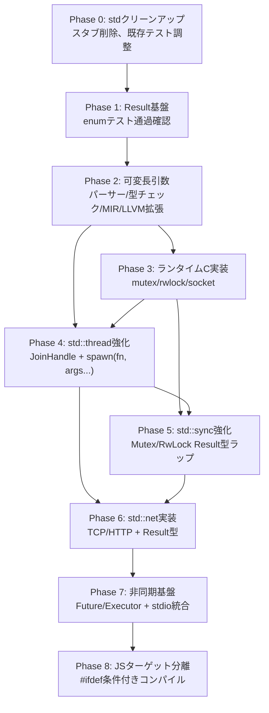

# v0.13.1 設計ドキュメント — "Production Concurrency & Networking"

## 概要

v0.13.0で確立した標準ライブラリ基盤を、本番利用可能な並行処理・ネットワーキング基盤へ進化させる。
すべての外部モジュール（OS依存機能）を統一`Result<T, E>`型でラップし、安全なエラーハンドリングを保証する。

## 目標

1. **Result型による統一エラーハンドリング** — thread/sync/net/http全APIをResult型でラップ
2. **可変長引数の言語サポート** — FFI専用の`...`を言語標準関数にも拡張し、`spawn(fn, arg1, arg2, ...)`を実現
3. **汎用スレッド実行** — void以外の任意関数をスレッドで実行可能に
4. **Mutex/RwLock実装** — データ競合・デッドロック防止のための同期プリミティブ
5. **HTTP/TCP通信** — Result型ラップ＋非同期対応
6. **JSターゲット分離** — ポインタ等のネイティブ専用機能をJSから切り離す

---

## std クリーンアップ（v0.13.1開始前）

v0.13.0で作成されたスタブ・未完成モジュールを一度削除し、v0.13.1で再実装する。

| 対象 | 状態 | 対応 |
|------|------|------|
| `std/async/mod.cm` | 全スタブ（Executor/Channel/AsyncMutex未動作） | **削除** → v0.13.1で再実装 |
| `std/core/async/mod.cm` | スタブ（Poll/Future/Waker/Context） | **削除** → v0.13.1で再実装 |
| `std/net/mod.cm` | 大部分TODO（socket API未リンク、パーサー未実装） | **削除** → v0.13.1で再実装 |
| `std/net/http.cm` | 大部分TODO（URLパーサー未実装、接続スタブ） | **削除** → v0.13.1で再実装 |
| `std/web/mod.cm` | JSバインディングスタブ | **保持**（JS向け機能） |
| `std/sync/mod.cm` | Mutex/RwLock/Atomic（extern名不一致、ランタイム未実装） | **リファクタリング** |
| `std/thread/mod.cm` | 基本pthread（void*のみ、Result無し） | **リファクタリング** |
| `std/core/mod.cm`, `std/core/string.cm` | 安定（min/max/clamp/panic等） | **保持** |
| `std/collections/`, `std/io/`, `std/math/`, `std/types/`, `std/mem/`, `std/iter/` | 安定 | **保持** |

---

## 実装順序（低レベルから積み上げ）



---

## Phase 0: stdクリーンアップ

### 削除対象

```bash
# 削除
std/async/mod.cm
std/core/async/mod.cm
std/net/mod.cm
std/net/http.cm
```

### std/mod.cmの更新

async/netの参照を削除（v0.13.1で段階的に再追加）。

---

## Phase 1: Result<T, E> 基盤整備

### 現状

Result型はユーザー定義enum（`tests/test_programs/result/builtin_result_test.cm`等）として使用可能。
コンパイラ組み込みではないため、各モジュールで再定義が必要。

### 方針

`std/core/result.cm`にResult型を定義し、全stdモジュールからimportする。

```cm
// std/core/result.cm
module std.core.result;

enum Result<T, E> {
    Ok(T),
    Err(E)
}

impl<T, E> Result<T, E> {
    bool is_ok() {
        match (self) {
            Result::Ok(_) => return true,
            Result::Err(_) => return false
        }
    }

    bool is_err() {
        return !self.is_ok();
    }

    T unwrap() {
        match (self) {
            Result::Ok(v) => return v,
            Result::Err(_) => {
                panic("unwrap called on Err");
            }
        }
    }

    T unwrap_or(T default_value) {
        match (self) {
            Result::Ok(v) => return v,
            Result::Err(_) => return default_value
        }
    }
}
```

---

## Phase 2: 可変長引数の言語サポート

### 現状

- FFI宣言（`extern "C"`, `use libc`）で`...`（Ellipsis）は対応済み
- パーサー: `Ellipsis`トークンあり（`token.hpp:142`）
- MIR: `is_variadic`フラグ対応（`nodes.hpp:630`）
- LLVM: `FunctionType::get(..., func.is_variadic)` 対応
- **未対応**: 言語標準関数（非FFI）での`...`使用

### 拡張方針

FFI限定の`is_variadic`を言語標準関数にも適用。

1. **パーサー拡張**: 通常関数定義でも`...`をパース可能に
2. **型チェック拡張**: 可変長引数の型解決（呼び出し側の引数型から推論）
3. **MIR lowering**: 可変長引数をvoid*配列としてパッキング
4. **LLVM codegen**: パック・アンパック処理の自動生成

```cm
// ユーザーの使い方
<R> JoinHandle<R> spawn(R(*fn)(...), ...) {
    // コンパイラが自動的に引数をvoid*配列にパック
    // wrapper関数を生成し、pthread_createに渡す
}

// 使用例
int add(int a, int b) { return a + b; }

JoinHandle<int> h = spawn(add, 10, 20);
Result<int, ThreadError> r = h.join();
```

### 内部メカニズム

```
spawn(add, 10, 20) のコンパイル:

1. コンパイラが add の型シグネチャ int(int, int) を取得
2. 引数パック構造体を自動生成:
   struct __SpawnArgs_add { int arg0; int arg1; }
3. ラッパー関数を自動生成:
   void* __spawn_wrapper_add(void* packed) {
       __SpawnArgs_add* args = packed as __SpawnArgs_add*;
       int result = add(args.arg0, args.arg1);
       int* heap_result = malloc(sizeof(int)) as int*;
       *heap_result = result;
       free(packed);
       return heap_result as void*;
   }
4. pthread_create呼び出し:
   __SpawnArgs_add* packed = malloc(sizeof(__SpawnArgs_add));
   packed.arg0 = 10; packed.arg1 = 20;
   pthread_create(&tid, null, __spawn_wrapper_add, packed);
```

> [!IMPORTANT]
> 可変長引数を完全に汎用化すると、型安全性の検証が複雑になります。
> v0.13.1では**関数ポインタの型情報から引数型を推論する限定的な実装**とし、
> 任意形式のvariadicsはv0.14.0以降に先送りします。

---

## Phase 3: ランタイムC実装

### 新規作成

| ファイル | 内容 |
|---------|------|
| `runtime_sync.c` (拡張) | pthread_mutex_init/lock/unlock/destroy, pthread_rwlock_* |
| `runtime_net.c` (新規) | socket/bind/listen/accept/connect/read/write/close |

### extern名統一

sync.cmの`atomic_load_i32`等を`cm_atomic_load_i32`（ランタイムC側の名前）に統一。

---

## Phase 4: std::thread 強化

```cm
// std/thread/mod.cm (v0.13.1)
module std.thread;

enum ThreadError {
    CreateFailed(string),
    JoinFailed(string),
    Panicked(string)
}

struct JoinHandle<T> {
    ulong thread_id;
}

impl<T> JoinHandle<T> {
    Result<T, ThreadError> join() {
        void* result = 0 as void*;
        int ret = pthread_join(self.thread_id, &result);
        if (ret != 0) {
            return Result::Err(ThreadError::JoinFailed("pthread_join failed"));
        }
        T* typed_result = result as T*;
        T value = *typed_result;
        free(result);
        return Result::Ok(value);
    }
}

// 任意の関数をスレッドで実行
export <R> JoinHandle<R> spawn(R() fn) { ... }
export <R, A> JoinHandle<R> spawn(R(A) fn, A a) { ... }
// ... 可変長引数版は Phase 2 完了後に実装
```

---

## Phase 5: std::sync 強化

```cm
// Mutex<T> — RAIIガード付き
impl<T> Mutex<T> {
    static Mutex<T> new(T value) { ... }
    Result<MutexGuard<T>, SyncError> lock() { ... }
    Result<MutexGuard<T>, SyncError> try_lock() { ... }
}

impl<T> MutexGuard<T> {
    T* get() { ... }
    ~self() { mutex_unlock(&self.mutex.raw); }  // RAII自動アンロック
}
```

---

## Phase 6: std::net 実装

TCP/HTTPをゼロから実装。全APIはResult型で返す。

```cm
Result<TcpStream, NetError> stream = TcpStream::connect("127.0.0.1:8080");
Result<int, NetError> bytes = stream.unwrap().write("Hello");
```

---

## Phase 7: 非同期基盤

Future/Pollパターンを再実装。スレッドプールベース。

---

## Phase 8: JSターゲット分離

`#ifdef CM_TARGET_NATIVE`で条件付きコンパイル。

---

## 検証計画

### 自動テスト

```bash
# 全バックエンドテスト
make tip0   # インタプリタ
make tlp0   # LLVM Native
make tlwp0  # WASM
```

### 新規テスト一覧（予定）

| テストファイル | Phase | 検証内容 |
|--------------|-------|---------|
| result/result_methods.cm | P1 | is_ok/is_err/unwrap/unwrap_or |
| thread/thread_generic.cm | P4 | 任意戻り値型のスレッド実行 |
| thread/thread_args.cm | P4 | 引数付きスレッド関数 |
| thread/thread_result.cm | P4 | Result型エラーハンドリング |
| sync/mutex_basic.cm | P5 | Mutex基本操作 |
| sync/mutex_raii.cm | P5 | MutexGuard RAII自動アンロック |
| sync/rwlock_basic.cm | P5 | RwLock基本操作 |
| net/tcp_echo.cm | P6 | TCP echo server/client |
| net/http_request.cm | P6 | HTTPリクエスト送受信 |

### 手動検証

- TCPテスト: ローカルecho serverを立ち上げ、clientが通信できるか確認
- HTTPテスト: ローカルHTTPサーバーとの通信確認
- ユーザーに確認: 「上記のテスト方法で十分か、他にテストすべきシナリオがあるか」
