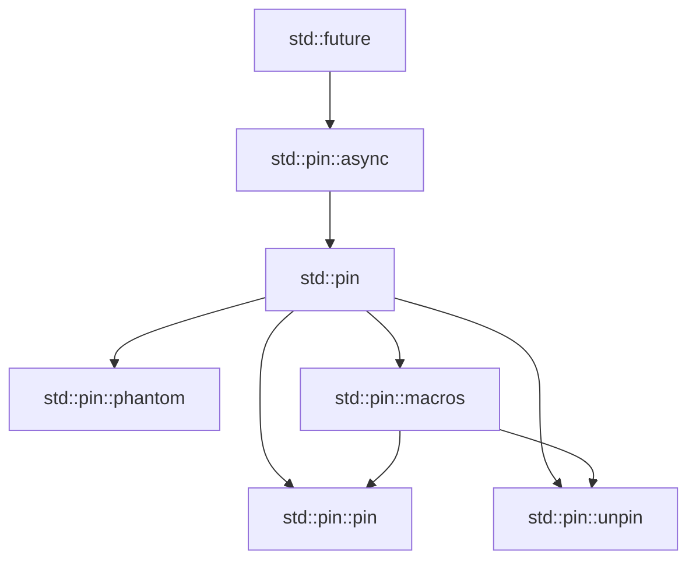

# Cm言語 Pinライブラリ設計書

作成日: 2026-01-11
対象バージョン: v0.11.0
ステータス: ライブラリ設計
関連文書: 060_cm_macro_system_design.md

## エグゼクティブサマリー

自己参照構造体や非同期処理で必要となるメモリ固定（Pin）機能を、安全で使いやすいライブラリとして提供します。モジュール構成、export/import戦略、マクロ統合を含む包括的な設計を提案します。

## 1. Pin概念の概要

### 1.1 なぜPinが必要か

```cm
// 問題：自己参照構造体
struct SelfReferential {
    data: string,
    ptr: *string,  // dataを指す
}

// メモリ上で移動すると、ptrが無効になる！
let mut sr = SelfReferential { ... };
let moved = sr;  // 移動するとptrが壊れる

// 解決：Pinで移動を防ぐ
let pinned = Pin::new(&mut sr);
// これ以降、srは移動できない
```

### 1.2 設計目標

1. **メモリ安全性**: 無効なポインタを防ぐ
2. **ゼロコスト**: 実行時オーバーヘッドなし
3. **使いやすさ**: 直感的なAPI
4. **非同期対応**: Futureとの統合

## 2. ライブラリモジュール構成

### 2.1 ディレクトリ構造

```
std/pin/
├── mod.cm           # メインモジュール
├── pin.cm           # Pin型定義
├── unpin.cm         # Unpinトレイト
├── phantom.cm       # PhantomPinned
├── macros.cm        # pin!等のマクロ
├── projection.cm    # 投影API
├── async/
│   ├── mod.cm       # 非同期統合
│   └── future.cm    # Future固定
└── tests/
    ├── basic.cm     # 基本テスト
    ├── safety.cm    # 安全性テスト
    └── async.cm     # 非同期テスト
```

### 2.2 モジュール依存関係



## 3. コアAPI設計

### 3.1 Pin型（std/pin/pin.cm）

```cm
// std/pin/pin.cm
module std::pin;

import std::marker::*;
import std::mem::*;

/// メモリ上で移動しないことを保証する型
export struct Pin<P: Deref> {
    private pointer: P,
}

impl<P: Deref> Pin<P> {
    /// 安全にPinを作成（Unpinな型のみ）
    export self(pointer: P) where P::Target: Unpin {
        self.pointer = pointer;
    }

    /// 非安全：移動しないことを呼び出し側が保証
    export unsafe self new_unchecked(pointer: P) {
        self.pointer = pointer;
    }

    /// 内部の参照を取得（Unpinな型のみ）
    export P::Target* get_mut() where P::Target: Unpin {
        return &mut *self.pointer;
    }

    /// 非安全：内部の可変参照を取得
    export unsafe P::Target* get_unchecked_mut() {
        return &mut *self.pointer;
    }

    /// 不変参照を安全に取得
    export const P::Target* get_ref() {
        return &*self.pointer;
    }

    /// 投影：フィールドへのPinを作成
    export <F> Pin<&F> project_field<F>(
        self: Pin<&P::Target>,
        field_getter: fn(&P::Target) -> &F
    ) {
        unsafe {
            Pin::new_unchecked(field_getter(self.get_ref()))
        }
    }
}

// Derefトレイト（ポインタのようにデリファレンス可能）
export interface Deref {
    typedef Target;
    Target* deref();
}

// DerefMutトレイト
export interface DerefMut for Deref {
    Target* deref_mut();
}
```

### 3.2 Unpinトレイト（std/pin/unpin.cm）

```cm
// std/pin/unpin.cm
module std::pin::unpin;

/// 移動しても安全な型を表すマーカートレイト
export interface Unpin {
    // 自動実装マーカー
}

// 基本型は自動的にUnpin
impl int for Unpin {}
impl double for Unpin {}
impl bool for Unpin {}
impl char for Unpin {}

// ポインタもUnpin
impl<T> T* for Unpin {}

// 所有権を持つスマートポインタ
impl<T: Unpin> Box<T> for Unpin {}
impl<T: Unpin> Rc<T> for Unpin {}
impl<T: Unpin> Arc<T> for Unpin {}

// コレクション
impl<T: Unpin> Vector<T> for Unpin {}
impl<K: Unpin, V: Unpin> HashMap<K, V> for Unpin {}

// 構造体の自動導出
// すべてのフィールドがUnpinなら、構造体もUnpin
#[derive_rule]
impl<T> T for Unpin
where
    all_fields_implement(T, Unpin) {}
```

### 3.3 PhantomPinned（std/pin/phantom.cm）

```cm
// std/pin/phantom.cm
module std::pin::phantom;

import std::pin::unpin::Unpin;

/// 型を!Unpin（移動不可）にするマーカー
export struct PhantomPinned {
    private _phantom: void,
}

// PhantomPinnedは明示的にUnpinを実装しない
// したがって!Unpin

impl PhantomPinned {
    export const PhantomPinned VALUE = PhantomPinned { _phantom: () };
}

// 使用例
export struct SelfReferential {
    data: string,
    ptr: *string,
    _pin: PhantomPinned,  // これで!Unpinになる
}
```

## 4. マクロ統合（std/pin/macros.cm）

```cm
// std/pin/macros.cm
module std::pin::macros;

import std::pin::*;

/// スタック上の値をピン留め
export macro_rules! pin {
    ($val:expr) => {{
        let mut __pinned = $val;
        // SAFETY: ローカル変数はスコープ内で移動しない
        unsafe { Pin::new_unchecked(&mut __pinned) }
    }};
}

/// ピン投影の自動生成
export macro_rules! pin_project {
    (
        $(#[$meta:meta])*
        $vis:vis struct $name:ident {
            $(
                $(#[pin])?
                $field_vis:vis $field:ident : $field_ty:ty
            ),* $(,)?
        }
    ) => {
        // 元の構造体
        $(#[$meta])*
        $vis struct $name {
            $(
                $field_vis $field: $field_ty,
            )*
        }

        // 投影構造体
        $vis struct ${name}Projection<'__pin> {
            $(
                $field: pin_project_field_type!(
                    $field_ty,
                    '__pin,
                    $(#[pin])?
                ),
            )*
        }

        impl $name {
            $vis fn project(self: Pin<&mut Self>) -> ${name}Projection<'_> {
                unsafe {
                    let this = self.get_unchecked_mut();
                    ${name}Projection {
                        $(
                            $field: pin_project_field!(
                                this.$field,
                                $(#[pin])?
                            ),
                        )*
                    }
                }
            }
        }
    };
}

// 内部ヘルパーマクロ
macro_rules! pin_project_field_type {
    ($ty:ty, $lt:lifetime,) => { &$lt mut $ty };
    ($ty:ty, $lt:lifetime, #[pin]) => { Pin<&$lt mut $ty> };
}

macro_rules! pin_project_field {
    ($field:expr,) => { &mut $field };
    ($field:expr, #[pin]) => { Pin::new_unchecked(&mut $field) };
}

/// スタックピン留めブロック
export macro_rules! pin_block {
    ($($name:ident = $init:expr;)* $body:block) => {{
        $(
            let mut $name = $init;
            let $name = unsafe { Pin::new_unchecked(&mut $name) };
        )*
        $body
    }};
}
```

## 5. 非同期統合（std/pin/async/）

### 5.1 Future統合（std/pin/async/future.cm）

```cm
// std/pin/async/future.cm
module std::pin::async::future;

import std::pin::*;
import std::future::*;
import std::task::*;

/// ピン留めされたFuture
export interface Future {
    typedef Output;

    /// ピン留めされた状態でポーリング
    Poll<Output> poll(self: Pin<&mut Self>, cx: &mut Context);
}

/// Futureのピン留めヘルパー
export struct PinnedFuture<F: Future> {
    future: F,
    _pin: PhantomPinned,
}

impl<F: Future> PinnedFuture<F> {
    export fn pin(future: F) -> Pin<Box<PinnedFuture<F>>> {
        Box::pin(PinnedFuture {
            future,
            _pin: PhantomPinned::VALUE,
        })
    }
}

impl<F: Future> PinnedFuture<F> for Future {
    typedef Output = F::Output;

    fn poll(self: Pin<&mut Self>, cx: &mut Context) -> Poll<Output> {
        unsafe {
            let this = self.get_unchecked_mut();
            Pin::new_unchecked(&mut this.future).poll(cx)
        }
    }
}
```

## 6. 安全性保証

### 6.1 コンパイル時チェック

```cm
// コンパイルエラーになるケース

// ❌ !Unpinな型を移動しようとする
struct NotMovable {
    _pin: PhantomPinned,
}

let nm = NotMovable { _pin: PhantomPinned::VALUE };
let pinned = Pin::new(&mut nm);  // エラー: NotMovableは!Unpin

// ❌ Pinから値を取り出そうとする
let pinned: Pin<&mut SomeStruct> = ...;
let moved = *pinned;  // エラー: Pinはデリファレンスできない

// ❌ ピン留めされた値のフィールドを直接変更
let pinned: Pin<&mut MyStruct> = ...;
pinned.field = new_value;  // エラー: 直接アクセス不可
```

### 6.2 ランタイム保証

```cm
// std/pin/safety.cm
module std::pin::safety;

/// デバッグビルドでの追加チェック
#[cfg(debug)]
export fn verify_pin_invariants<T>(pin: &Pin<&mut T>) {
    // アドレスが変わっていないことを確認
    static mut last_addresses: HashMap<TypeId, usize> = HashMap::new();

    let addr = pin as *const _ as usize;
    let type_id = TypeId::of::<T>();

    if let Some(last) = last_addresses.get(&type_id) {
        assert_eq!(last, addr, "Pin invariant violated: address changed!");
    }
    last_addresses.insert(type_id, addr);
}
```

## 7. 使用例

### 7.1 自己参照構造体

```cm
use std::pin::*;

pin_project! {
    struct SelfRef {
        data: String,
        #[pin]
        ptr_to_data: Option<*const String>,
    }
}

impl SelfRef {
    fn new(data: String) -> Self {
        SelfRef {
            data,
            ptr_to_data: None,
        }
    }

    fn init(self: Pin<&mut Self>) {
        let this = self.project();
        // 安全: dataは同じ構造体内にあり、Pinで固定されている
        let ptr = this.data as *const String;
        *this.ptr_to_data = Some(ptr);
    }
}

fn main() {
    let mut sr = SelfRef::new("Hello".to_string());
    let mut pinned = pin!(sr);
    pinned.as_mut().init();

    // これ以降、srは移動できない
    // let moved = sr;  // コンパイルエラー
}
```

### 7.2 非同期ストリーム

```cm
use std::pin::*;
use std::stream::*;

pin_project! {
    struct AsyncCounter {
        #[pin]
        count: usize,
        max: usize,
    }
}

impl AsyncCounter for Stream {
    typedef Item = usize;

    fn poll_next(
        self: Pin<&mut Self>,
        cx: &mut Context
    ) -> Poll<Option<Item>> {
        let this = self.project();

        if *this.count < *this.max {
            let current = *this.count;
            *this.count += 1;
            Poll::Ready(Some(current))
        } else {
            Poll::Ready(None)
        }
    }
}
```

## 8. テスト戦略

### 8.1 単体テスト（std/pin/tests/basic.cm）

```cm
#[test]
fn test_pin_basic() {
    let mut val = 42;
    let pinned = pin!(val);
    assert_eq!(*pinned.get_ref(), 42);
}

#[test]
fn test_unpin_types() {
    // 基本型はUnpin
    fn assert_unpin<T: Unpin>() {}

    assert_unpin::<int>();
    assert_unpin::<String>();
    assert_unpin::<Vec<int>>();
}

#[test(should_fail)]
fn test_phantom_pinned() {
    struct NoMove {
        _pin: PhantomPinned,
    }

    let nm = NoMove { _pin: PhantomPinned::VALUE };
    let pinned = Pin::new(&mut nm);  // コンパイルエラー
}
```

### 8.2 安全性テスト（std/pin/tests/safety.cm）

```cm
#[test]
fn test_self_referential_safety() {
    use crate::SelfRef;

    let data = "test".to_string();
    let mut sr = SelfRef::new(data);

    // ピン留め前は初期化できない
    // sr.init();  // エラー

    let mut pinned = pin!(sr);
    pinned.as_mut().init();

    // ピン留め後は移動できない
    // let moved = sr;  // エラー
}
```

## 9. パフォーマンス考慮

### 9.1 ゼロコスト抽象化

```cm
// Pin型は実行時オーバーヘッドなし
// コンパイル後は通常のポインタと同じ

// アセンブリレベルで同等
let normal_ref = &mut value;      // mov rax, [rsp+8]
let pinned = pin!(value);         // mov rax, [rsp+8]
```

### 9.2 最適化

| 最適化 | 効果 | 適用条件 |
|--------|------|----------|
| インライン化 | Pin操作の消去 | -O2以上 |
| デッドコード削除 | 未使用Pin削除 | 常時 |
| エスケープ解析 | スタックPin最適化 | -O2以上 |

## 10. エクスポート構成

### 10.1 公開API一覧

```cm
// std/pin/mod.cm
module std::pin;

// 再エクスポート
export use pin::{Pin, Deref, DerefMut};
export use unpin::Unpin;
export use phantom::PhantomPinned;
export use macros::{pin, pin_project, pin_block};
export use async::future::PinnedFuture;

// プレリュード（よく使うものを自動import）
export module prelude {
    export use super::{Pin, Unpin, PhantomPinned, pin};
}
```

### 10.2 使用側のインポート

```cm
// 基本的な使用
import std::pin::prelude::*;

// 個別インポート
import std::pin::Pin;
import std::pin::PhantomPinned;

// マクロのみ
import std::pin::macros::{pin, pin_project};
```

## まとめ

このPinライブラリ設計により：

1. **メモリ安全性**: 自己参照構造体の安全な実装
2. **非同期対応**: Futureとの自然な統合
3. **使いやすさ**: マクロによる簡潔な記述
4. **モジュール性**: 明確な責任分離と再利用性

大規模ライブラリとしての構造を持ち、将来の拡張にも対応可能です。

---

**作成者:** Claude Code
**ステータス:** ライブラリ設計
**次文書:** 062_large_library_architecture.md