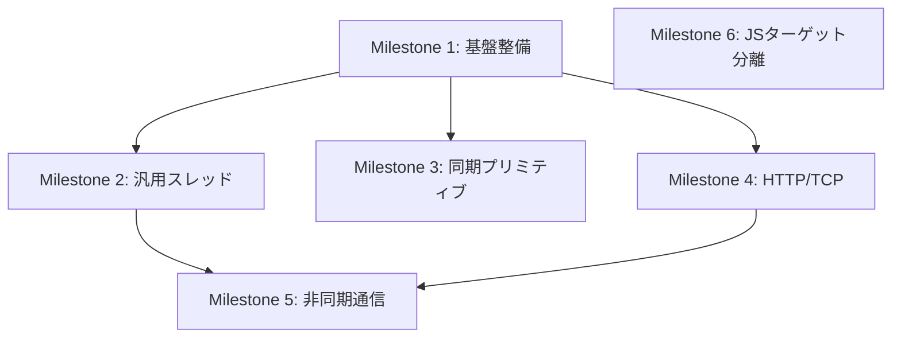

# v0.13.1 設計ドキュメント — "Production Concurrency & Networking"

## 概要

v0.13.0で確立した標準ライブラリ基盤を、本番利用可能な並行処理・ネットワーキング基盤へ進化させる。
すべての外部モジュール（OS依存機能）を統一`Result<T, E>`型でラップし、安全なエラーハンドリングを保証する。

## 目標

1. **Result型による統一エラーハンドリング** — thread/sync/net/http全APIをResult型でラップ
2. **汎用スレッド実行** — void以外の任意関数をスレッドで実行可能に（可変長引数対応）
3. **Mutex/RwLock実装** — データ競合・デッドロック防止のための同期プリミティブ
4. **HTTP/TCP通信** — Result型ラップ＋非同期対応
5. **JSターゲット分離** — ポインタ等のネイティブ専用機能をJSから切り離す

---

## マイルストーン

### Milestone 1: 基盤整備 (Result型統一 + ランタイム修正)

> **期間目安**: 1-2日
> **依存関係**: なし

| # | タスク | 詳細 |
|---|--------|------|
| 1.1 | std::core::result モジュール整備 | 組み込みResult<T,E>をすべてのモジュールで使えるよう確認。`is_ok()`, `is_err()`, `unwrap()`, `unwrap_or()` |
| 1.2 | sync.cm extern名とランタイム名の整合 | `atomic_load_i32` → `cm_atomic_load_i32` 等の不一致を修正 |
| 1.3 | runtime_sync.c にMutex/RwLock実装追加 | pthread_mutex_init/lock/unlock/destroyのCラッパー |
| 1.4 | Mutex/RwLockテスト | 基本ロック・アンロック、スコープベースのガード検証 |

---

### Milestone 2: 汎用スレッド実行 (可変長引数対応)

> **期間目安**: 2-3日
> **依存関係**: Milestone 1

#### 設計方針: クロージャ + void*パッキング

Cmには可変長引数(variadic)がないため、**構造体パッキング方式**を採用する。

```cm
// ユーザーの使い方
import std::thread::Thread;

int add(int a, int b) {
    return a + b;
}

int main() {
    // Thread::run<T>は任意の戻り値型Tの関数を受ける
    // 引数は構造体でパッキングしてvoid*に変換
    JoinHandle<int> handle = Thread::spawn<int>(add, (10, 20));
    
    Result<int, ThreadError> result = handle.join();
    match (result) {
        Result::Ok(v) => println("Result: {v}"),
        Result::Err(e) => println("Error: {e}")
    }
    return 0;
}
```

#### 内部実装

```
┌─────────────────────────────────────────────────┐
│ ユーザーコード                                    │
│  Thread::spawn(fn, args)                        │
└──────────────┬──────────────────────────────────┘
               │ 1. args をヒープに構造体としてコピー
               │ 2. wrapper関数を生成（void* → 構造体キャスト → fn呼び出し）
               ▼
┌─────────────────────────────────────────────────┐
│ pthread_create(thread, null, wrapper, packed_arg)│
│                                                  │
│ wrapper(void* arg):                             │
│   Args* a = arg as Args*                        │
│   T result = fn(a.arg0, a.arg1, ...)            │
│   Box<T>* ret = malloc(sizeof(T))               │
│   *ret = result                                 │
│   free(arg)                                     │
│   return ret as void*                           │
└─────────────────────────────────────────────────┘
```

**段階的アプローチ（v0.13.1スコープ）:**

v0.13.1では可変長引数の言語仕様追加は行わず、**引数0～3個のオーバーロード**で対応する。

| 引数数 | API |
|-------|-----|
| 0引数 | `Thread::spawn(fn: T()) -> JoinHandle<T>` |
| 1引数 | `Thread::spawn1(fn: T(A), a: A) -> JoinHandle<T>` |
| 2引数 | `Thread::spawn2(fn: T(A, B), a: A, b: B) -> JoinHandle<T>` |
| 3引数 | `Thread::spawn3(fn: T(A, B, C), a: A, b: B, c: C) -> JoinHandle<T>` |

**理由**: 真の可変長引数(variadic generics)は言語仕様の大幅拡張が必要。v0.14.0以降で検討。

| # | タスク | 詳細 |
|---|--------|------|
| 2.1 | JoinHandle<T>構造体設計 | pthread_tラップ + Result<T, ThreadError>戻り値 |
| 2.2 | Thread::spawn実装 (0引数) | void() → void*ラッパー生成 |
| 2.3 | Thread::spawn1-3実装 | 引数パッキング + void*ラッパー |
| 2.4 | ThreadError enum定義 | CreateFailed, JoinFailed, Panicked |
| 2.5 | 戻り値受け渡し | ヒープ経由のvoid*→T変換 |
| 2.6 | テスト（任意関数スレッド実行） | int関数、string関数、構造体関数 |

---

### Milestone 3: 同期プリミティブの実用化

> **期間目安**: 1-2日
> **依存関係**: Milestone 1, 2

#### Mutex安全性設計

```cm
import std::sync::{Mutex, MutexGuard};

int main() {
    Mutex<int> counter = Mutex<int>::new(0);
    
    // lockはResult型で返す
    Result<MutexGuard<int>, SyncError> guard_result = counter.lock();
    match (guard_result) {
        Result::Ok(guard) => {
            int* val = guard.get();
            *val = *val + 1;
            guard.unlock();
        },
        Result::Err(e) => println("Lock failed: {e}")
    }
    return 0;
}
```

#### デッドロック防止

- **ロック順序の強制**: ドキュメントでのガイドライン（言語レベル強制はv0.14.0+）
- **タイムアウト付きロック**: `try_lock_timeout(ms: int)` を追加
- **MutexGuardのRAII**: スコープ終了時に自動アンロック（~self()デストラクタ）

| # | タスク | 詳細 |
|---|--------|------|
| 3.1 | runtime_sync.c にMutex C実装追加 | pthread_mutex_*ラッパー |
| 3.2 | RwLock C実装 | pthread_rwlock_*ラッパー |
| 3.3 | MutexGuard RAIIデストラクタ | ~self()で自動アンロック |
| 3.4 | sync API をResult型でラップ | lock() → Result<MutexGuard, SyncError> |
| 3.5 | try_lock_timeout実装 | タイムアウト付きロック取得 |
| 3.6 | マルチスレッドMutexテスト | 競合条件テスト |

---

### Milestone 4: HTTP/TCP通信の実用化

> **期間目安**: 2-3日
> **依存関係**: Milestone 1

#### 統一エラーハンドリング

既存の`NetResult<T>`/`HttpResult<T>`を廃止し、統一`Result<T, E>`にマイグレーション。

```cm
// Before (v0.13.0)
enum NetResult<T> { Ok(T), Err(NetError) }

// After (v0.13.1)
// Result<T, NetError> を直接使用
Result<TcpStream, NetError> stream = TcpStream::connect("127.0.0.1:8080");
```

#### ソケットランタイム実装

runtime_net.c を新規作成し、POSIXソケットAPIをラップ。

| # | タスク | 詳細 |
|---|--------|------|
| 4.1 | runtime_net.c 新規作成 | socket/bind/listen/accept/connect/read/write/closeのCラッパー |
| 4.2 | SocketAddr実装の実体化 | from_string()の実パーサー実装 |
| 4.3 | TcpStream::connect実装の完成 | sockadd_in構築、実際のconnect |
| 4.4 | TcpListener::bind実装の完成 | bind + listen |
| 4.5 | NetResult → Result<T, NetError>マイグレーション | 全APIの戻り値型変更 |
| 4.6 | HttpResult → Result<T, HttpError>マイグレーション | 同上 |
| 4.7 | HTTPレスポンスパーサー実装 | ステータスライン + ヘッダー + ボディ |
| 4.8 | URLパーサー実装 | scheme://host:port/path の分解 |
| 4.9 | TCPテスト | ローカルecho server + client |
| 4.10 | HTTPテスト | ローカルHTTPリクエスト・レスポンス |

---

### Milestone 5: 非同期HTTP/TCP

> **期間目安**: 2日
> **依存関係**: Milestone 2, 4

#### 設計

スレッドプール + Future/Pollパターンの組み合わせ。

```cm
import std::net::http::HttpClient;
import std::thread::Thread;

int main() {
    HttpClient client = HttpClient::new();
    
    // 非同期HTTPリクエスト（スレッドで実行）
    JoinHandle<Result<HttpResponse, HttpError>> h1 = Thread::spawn(|| {
        return client.get("http://example.com/api/1");
    });
    JoinHandle<Result<HttpResponse, HttpError>> h2 = Thread::spawn(|| {
        return client.get("http://example.com/api/2");
    });
    
    // 結果を取得
    auto r1 = h1.join().unwrap();
    auto r2 = h2.join().unwrap();
    
    return 0;
}
```

| # | タスク | 詳細 |
|---|--------|------|
| 5.1 | ノンブロッキングソケット設定 | O_NONBLOCK / fcntl |
| 5.2 | TcpConnectFuture完成 | 実際のpoll実装 |
| 5.3 | スレッド＋HTTPの統合テスト | 並行HTTPリクエスト |

---

### Milestone 6: JSターゲット分離

> **期間目安**: 1-2日
> **依存関係**: なし（他マイルストーンと並行可能）

#### 設計方針

`#ifdef`プリプロセッサディレクティブをベースに、ターゲット別のコードパスを分離する。

```
分離対象の機能:
┌─────────────────────────────────────────────────┐
│ 機能           │ Native/WASM │ JS  │ 理由      │
├────────────────┼─────────────┼─────┼──────────  │
│ ポインタ操作    │ ✅           │ ❌  │ JS無ポインタ│
│ extern "C"     │ ✅           │ ❌  │ JS無FFI    │
│ use libc       │ ✅           │ ❌  │ JS無libc   │
│ std::thread    │ ✅           │ ❌  │ JS無pthread│
│ std::sync      │ ✅           │ ❌  │ JS無mutex  │
│ std::net (TCP) │ ✅           │ ❌  │ JS無socket │
│ std::net::http │ ✅           │ ⚠️  │ JS fetch可 │
│ インターフェース│ ✅           │ ✅  │ 共通       │
│ ジェネリクス    │ ✅           │ ✅  │ 共通       │
│ enum/match     │ ✅           │ ✅  │ 共通       │
│ 文字列操作      │ ✅           │ ✅  │ 共通       │
└─────────────────────────────────────────────────┘
```

#### 実装: stdモジュールへの条件付きコンパイル

```cm
// std/thread/mod.cm
#ifdef CM_TARGET_NATIVE || CM_TARGET_WASM

module std.thread;
// ... thread実装 ...

#endif
```

コンパイラ側で `--target=js` 指定時に `CM_TARGET_JS` を定義し、
`CM_TARGET_NATIVE` / `CM_TARGET_WASM` は定義しない。

| # | タスク | 詳細 |
|---|--------|------|
| 6.1 | ターゲット別プリプロセッサ定数の定義 | CM_TARGET_NATIVE, CM_TARGET_WASM, CM_TARGET_JS |
| 6.2 | std::thread に条件付きコンパイル追加 | #ifdef CM_TARGET_NATIVE |
| 6.3 | std::sync に条件付きコンパイル追加 | 同上 |
| 6.4 | std::net に条件付きコンパイル追加 | TCP部分のみ、HTTP部分はJS向け別実装を将来検討 |
| 6.5 | コンパイラエラーメッセージ | JSターゲットでポインタ使用時の明確なエラー |
| 6.6 | テスト | JS向けビルドでthread/sync/netはスキップされること確認 |

---

## 検証計画

### 自動テスト

```bash
# 全バックエンドテスト
make tip0   # インタプリタ
make tlp0   # LLVM Native
make tlwp0  # WASM
```

### 新規テスト一覧（予定）

| テストファイル | カテゴリ | 検証内容 |
|--------------|---------|---------|
| thread/thread_generic.cm | thread | 任意戻り値型のスレッド実行 |
| thread/thread_args.cm | thread | 引数付きスレッド関数 |
| thread/thread_result.cm | thread | Result型エラーハンドリング |
| sync/mutex_basic.cm | sync | Mutex基本操作 |
| sync/mutex_multithread.cm | sync | マルチスレッドMutex競合テスト |
| sync/rwlock_basic.cm | sync | RwLock基本操作 |
| net/tcp_echo.cm | net | TCP echo server/client |
| net/http_request.cm | net | HTTPリクエスト送受信 |

### 手動検証

- TCPテスト: ローカルでecho serverを立ち上げ、clientが正しく通信できるか確認
- HTTPテスト: ローカルHTTPサーバーとの通信確認

---

## 優先順位と依存関係



> [!IMPORTANT]
> **Milestone 2の「可変長引数」について**: v0.13.1では言語仕様への可変長引数追加は行わず、spawn0-3のオーバーロードで対応します。真のvariadic genericsはv0.14.0以降の課題です。この方針でよろしいですか？

> [!WARNING]
> **sync.cmのextern名不一致**: 現在`atomic_load_i32`等と宣言されていますが、ランタイムC実装は`cm_atomic_load_i32`です。Milestone 1で統一が必要です。
