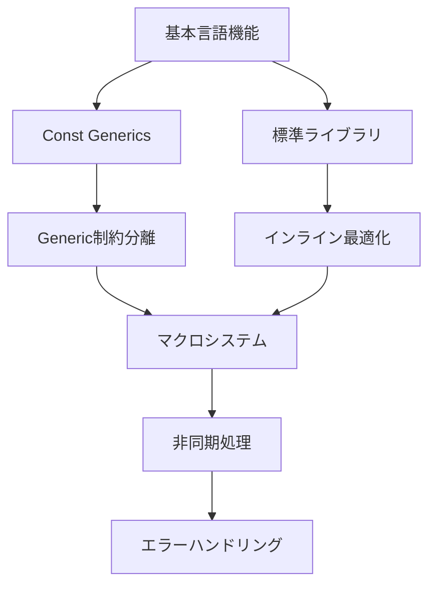

# Cm言語実装ロードマップ

作成日: 2026-01-11
最終更新: 2026-01-11
バージョン: v0.11.0

## 概要

このドキュメントはCm言語の実装進捗と今後の開発計画を記録します。各機能の実装状況を追跡し、開発の優先順位を管理します。

**注**: このロードマップは設計文書番号に基づいており、プロジェクトの公式ロードマップ（`ROADMAP.md`）とは別に、詳細な実装計画を追跡するために使用されます。

## 実装状況凡例

- ✅ **完了**: 実装・テスト完了
- 🚧 **進行中**: 現在実装中
- 📝 **設計済**: 設計完了、実装待ち
- 🔮 **計画中**: 構想段階
- ❌ **延期**: 一時的に延期
- 🗑️ **廃止**: 実装しない

## 実装ロードマップ

### Phase 1: 基盤機能（001-029）✅

| ID | 機能名 | 状態 | 設計文書 | 備考 |
|----|--------|------|----------|------|
| 001-027 | 基本言語機能 | ✅ | - | v0.10.0までに完了 |
| 028 | Const Generics | 🚧 | `028_const_generics_design.md` | 実装中 |
| 029 | （未公開機能） | ✅ | - | 完了済み |

### Phase 2: 標準ライブラリ移行（030-039）📝

| ID | 機能名 | 状態 | 設計文書 | 備考 |
|----|--------|------|----------|------|
| 030 | Runtime→Stdlib移行 | 📝 | `030_runtime_to_stdlib_migration.md` | cm_*関数の移行 |
| 031 | Stdlib実装詳細 | 📝 | `031_stdlib_implementation_details.md` | |
| 032 | 移行ガイド | 📝 | `032_migration_guide.md` | |
| 033 | 完全移行設計 | 📝 | `033_runtime_to_stdlib_complete_design.md` | |
| 034 | Vector実装 | 📝 | `033_runtime_to_stdlib_complete_design.md` | 動的配列 |
| 035 | HashMap実装 | 📝 | `033_runtime_to_stdlib_complete_design.md` | ハッシュマップ |
| 036 | String改善 | 📝 | `033_runtime_to_stdlib_complete_design.md` | UTF-8サポート |
| 037 | File I/O | 📝 | `033_runtime_to_stdlib_complete_design.md` | ファイル操作 |
| 038 | Network | 📝 | `033_runtime_to_stdlib_complete_design.md` | ソケット通信 |
| 039 | Thread | 📝 | `033_runtime_to_stdlib_complete_design.md` | スレッド対応 |

### Phase 3: 最適化機能（040-049）📝

| ID | 機能名 | 状態 | 設計文書 | 備考 |
|----|--------|------|----------|------|
| 040 | Inline展開 | 📝 | `040_inline_expansion_design.md` | |
| 041 | Inline vs Macro | 📝 | `041_inline_vs_macro_comparison.md` | |
| 042 | Macro Metaprogramming | 📝 | `042_macro_metaprogramming_capability.md` | |
| 043 | Inline最適化 | 📝 | `043_inline_optimization_benefits.md` | |
| 044 | Assembly Level | 📝 | `044_inline_assembly_level_explanation.md` | |
| 045 | Inline vs Define | 📝 | `045_inline_vs_define_critical_difference.md` | |
| 046 | Inline落とし穴 | 📝 | `046_inline_pitfalls_and_detection.md` | |
| 047 | LTO | 📝 | `050_cm_inline_comprehensive_design.md` | Link Time Optimization |
| 048 | PGO | 📝 | `050_cm_inline_comprehensive_design.md` | Profile Guided Optimization |
| 049 | SIMD | 📝 | `050_cm_inline_comprehensive_design.md` | ベクトル化 |

### Phase 4: インライン実装（050-059）📝

| ID | 機能名 | 状態 | 設計文書 | 備考 |
|----|--------|------|----------|------|
| 050 | Inline総合設計 | 📝 | `050_cm_inline_comprehensive_design.md` | |
| 051 | Inline実装仕様 | 📝 | `051_cm_inline_implementation_spec.md` | |
| 052 | Inline Parser | 📝 | `050_cm_inline_comprehensive_design.md` | パーサー実装 |
| 053 | Inline HIR | 📝 | `050_cm_inline_comprehensive_design.md` | HIR統合 |
| 054 | Inline MIR | 📝 | `050_cm_inline_comprehensive_design.md` | MIR最適化 |
| 055 | Inline LLVM | 📝 | `050_cm_inline_comprehensive_design.md` | LLVM統合 |
| 056 | Inline Test | 📝 | `050_cm_inline_comprehensive_design.md` | テストスイート |
| 057 | Inline Benchmark | 📝 | `050_cm_inline_comprehensive_design.md` | パフォーマンス測定 |
| 058 | Inline Debug | 📝 | `050_cm_inline_comprehensive_design.md` | デバッグサポート |
| 059 | Inline Doc | 📝 | `050_cm_inline_comprehensive_design.md` | ドキュメント |

### Phase 5: マクロシステム（060-069）📝

| ID | 機能名 | 状態 | 設計文書 | 備考 |
|----|--------|------|----------|------|
| 060 | Macroシステム設計 | 📝 | `060_cm_macro_system_design.md` | Cm構文統一版 |
| 061 | Pin Library | 📝 | `061_pin_library_design.md` | メモリ固定 |
| 062 | 大規模ライブラリ | 📝 | `062_large_library_architecture.md` | |
| 063 | Macro実装計画 | 📝 | `063_macro_implementation_plan.md` | |
| 064 | Macro実装進捗 | 📝 | `064_macro_implementation_progress.md` | |
| 065 | 設計改訂まとめ | 📝 | `065_design_revision_summary.md` | Unpin廃止 |
| 066 | Macro Parser | 📝 | `064_macro_implementation_progress.md` | パーサー実装 |
| 067 | Macro Expansion | 📝 | `064_macro_implementation_progress.md` | 展開エンジン |
| 068 | Macro Hygiene | 📝 | `064_macro_implementation_progress.md` | 衛生的マクロ |
| 069 | Macro Test | 📝 | `064_macro_implementation_progress.md` | テストスイート |

### Phase 6: 型システム拡張（070-079）📝

| ID | 機能名 | 状態 | 設計文書 | 備考 |
|----|--------|------|----------|------|
| 070 | Generic制約分離 | 📝 | `070_generic_constraint_separation.md` | where句導入 |
| 071 | BNFパーサー設計 | 📝 | `071_bnf_parser_refactoring.md` | |
| 072 | BNF統合 | 📝 | `072_bnf_parser_integration.md` | |
| 073 | BNF実装まとめ | 📝 | `073_bnf_integration_summary.md` | |
| 074 | BNF文法修正 | 📝 | `074_bnf_grammar_corrections.md` | キーワード修正 |
| 075 | ツール再編成 | 📝 | `075_tool_reorganization.md` | scripts/移動 |
| 076 | Interface継承 | 📝 | `076_interface_inheritance_design.md` | with句による継承 |
| 077 | Union Types | 🔮 | - | ユニオン型 |
| 078 | Trait Objects | 🔮 | - | 動的ディスパッチ |
| 079 | Associated Types | 🔮 | - | 関連型 |

### Phase 7: 非同期・並行処理（080-089）🔮

| ID | 機能名 | 状態 | 設計文書 | 備考 |
|----|--------|------|----------|------|
| 080 | Async/Await | 🔮 | - | 非同期構文 |
| 081 | Future/Promise | 🔮 | - | 非同期抽象 |
| 082 | Executor | 🔮 | - | 実行エンジン |
| 083 | Channel | 🔮 | - | メッセージパッシング |
| 084 | Atomic | 🔮 | - | アトミック操作 |
| 085 | Mutex/RwLock | 🔮 | - | 同期プリミティブ |
| 086 | Thread Pool | 🔮 | - | スレッドプール |
| 087 | Work Stealing | 🔮 | - | タスクスケジューラ |
| 088 | Parallel Iterator | 🔮 | - | 並列イテレータ |
| 089 | Memory Model | 🔮 | - | メモリモデル定義 |

### Phase 8: エラーハンドリング（090-099）🔮

| ID | 機能名 | 状態 | 設計文書 | 備考 |
|----|--------|------|----------|------|
| 090 | Result Type | 🔮 | - | Result<T,E> |
| 091 | Option Type | 🔮 | - | Option<T> |
| 092 | Try Operator | 🔮 | - | ?演算子 |
| 093 | Panic Handler | 🔮 | - | パニック処理 |
| 094 | Stack Unwinding | 🔮 | - | スタック巻き戻し |
| 095 | Error Trait | 🔮 | - | エラートレイト |
| 096 | Custom Errors | 🔮 | - | カスタムエラー |
| 097 | Error Chain | 🔮 | - | エラーチェーン |
| 098 | Debug Info | 🔮 | - | デバッグ情報 |
| 099 | Error Recovery | 🔮 | - | エラー回復 |

## 優先度マトリックス

### 高優先度（v0.11.0対象）
1. **028**: Const Generics（実装中）
2. **030-033**: 標準ライブラリ移行
3. **070-075**: 型システム拡張とBNF

### 中優先度（v0.12.0対象）
1. **040-051**: インライン最適化
2. **060-069**: マクロシステム
3. **034-036**: 基本コンテナ実装

### 低優先度（v1.0.0以降）
1. **080-089**: 非同期・並行処理
2. **090-099**: エラーハンドリング
3. **037-039**: 高度なライブラリ機能

## 進捗サマリー

### 完了済み
- ✅ 001-027: 基本言語機能
- ✅ 029: （未公開機能）

### 現在作業中
- 🚧 028: Const Generics

### 次の実装予定
- 📝 030: Runtime→Stdlib移行
- 📝 031: Stdlib実装詳細
- 📝 032: 移行ガイド

## 技術的依存関係

## 更新履歴

| 日付 | 内容 | 担当 |
|------|------|------|
| 2026-01-11 | 初版作成 | Claude Code |

## 注記

- 各フェーズは並行して進行可能
- 優先度は開発状況により変更される場合があります
- 🔮の項目は構想段階で、設計文書作成後に📝へ移行します

---

**管理者:** Claude Code
**次回更新予定:** 028完了時または新機能設計時