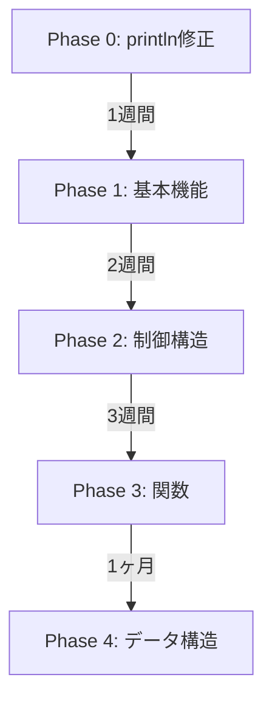

# Cm言語 リグレッションテスト一覧

## テスト構造

```
tests/test_programs/
├── p0_basics/          # Phase 0: 最小動作
├── p1_basic_features/  # Phase 1: 基本機能
├── p2_control_flow/    # Phase 2: 制御構造
├── p3_functions/       # Phase 3: 関数（未実装）
├── p4_data_structures/ # Phase 4: データ構造（未実装）
├── errors/             # エラーケース
├── basic/              # 既存の基本テスト
└── control_flow/       # 既存の制御フローテスト
```

## Phase 0: 最小動作テスト ✅

| テストファイル | 説明 | 期待結果 | 状態 |
|--------------|------|----------|------|
| p0_hello_world.cm | Hello World出力 | "Hello, World!" | 🔧 要修正 |
| p0_print_int.cm | 整数出力 | 42, 0, -123 | 🔧 要修正 |
| p0_main_function.cm | 空のmain関数 | EXIT: 0 | ✅ 動作 |
| p0_return.cm | return文 | EXIT: 42 | ✅ 動作 |

## Phase 1: 基本機能テスト ✅

| テストファイル | 説明 | テスト内容 | 状態 |
|--------------|------|-----------|------|
| p1_int_variable.cm | 変数宣言 | int変数の宣言と初期化 | 🔧 |
| p1_assignment.cm | 代入 | 変数への代入、再代入 | 🔧 |
| p1_arithmetic.cm | 算術演算 | +, -, *, /, %, 優先順位 | 🔧 |
| p1_comparison.cm | 比較演算 | ==, !=, <, <=, >, >= | 🔧 |

## Phase 2: 制御構造テスト ✅

| テストファイル | 説明 | テスト内容 | 状態 |
|--------------|------|-----------|------|
| p2_if.cm | if文 | 条件分岐の基本 | 🔧 |
| p2_if_else.cm | if-else | else節の動作 | 🔧 |
| p2_while.cm | whileループ | 繰り返し処理 | 🔧 |
| p2_for.cm | forループ | 初期化、条件、更新 | ❌ 未実装 |

## エラーケーステスト ✅

| テストファイル | 説明 | 期待エラー | 状態 |
|--------------|------|-----------|------|
| err_undefined_variable.cm | 未定義変数 | Undefined variable | 🔧 |
| err_type_mismatch.cm | 型不一致 | Type mismatch | 🔧 |
| err_wrong_arg_count.cm | 引数数エラー | Wrong argument count | 🔧 |

## テスト実行方法

### 1. 優先度別テスト実行

```bash
# 全フェーズ実行
./tests/runners/priority_tests.sh

# 特定フェーズのみ
./tests/runners/priority_tests.sh --phase=0
./tests/runners/priority_tests.sh --phase=1

# 詳細出力
./tests/runners/priority_tests.sh --verbose

# 最初のエラーで停止
./tests/runners/priority_tests.sh --stop-on-fail
```

### 2. 統一テストランナー

```bash
# インタープリタで全テスト
./tests/runners/test_runner.sh --backend=interpreter --suite=all

# 特定のテストファイル
./tests/runners/test_runner.sh --backend=interpreter p0_basics/p0_hello_world.cm
```

### 3. リグレッションテスト

```bash
# リグレッション実行
./tests/runners/regression.sh

# ベースライン保存
./tests/runners/regression.sh --save-baseline
```

## 現在の状態

### ✅ テスト作成完了
- Phase 0: 4個のテスト
- Phase 1: 4個のテスト
- Phase 2: 4個のテスト
- エラーケース: 3個のテスト
- **合計: 15個のテスト**

### 🔧 要実装機能

1. **println出力接続**（最優先）
   - MIRインタープリタでprintlnの出力を標準出力に接続
   - 現在は終了コードのみ返している

2. **変数と演算**
   - 変数宣言（int x = 42）
   - 算術演算の完全サポート
   - 比較演算の結果出力

3. **制御フロー**
   - if-else文の完全動作
   - whileループの検証
   - forループの実装

## 開発優先順位



## 次のアクション

1. **即座に対応**
   ```cpp
   // MIRインタープリタでprintln実装
   if (func_name == "println") {
       std::cout << arg_value << std::endl;
   }
   ```

2. **テスト実行**
   ```bash
   ./tests/runners/priority_tests.sh --phase=0 --verbose
   ```

3. **段階的修正**
   - Phase 0を完全にパス
   - Phase 1に進む
   - 各フェーズ完了ごとにコミット

---

更新: 2024年12月6日